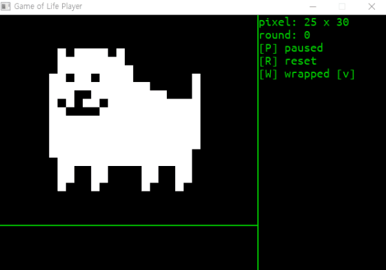

# Game of Life Simulator

An GOL simulator with simple interface made with SDL2.  
Press keyboard buttons to try out the simulator.

+ `[p]` : Play / Pause button.
+ `[R]` : Reset button, it returns to inital status.
+ `[W]` : If it is checked, the edge of the simualting screen is wrapped up.

There's pre-compiled `a.exe` to try it out. (If it works)
